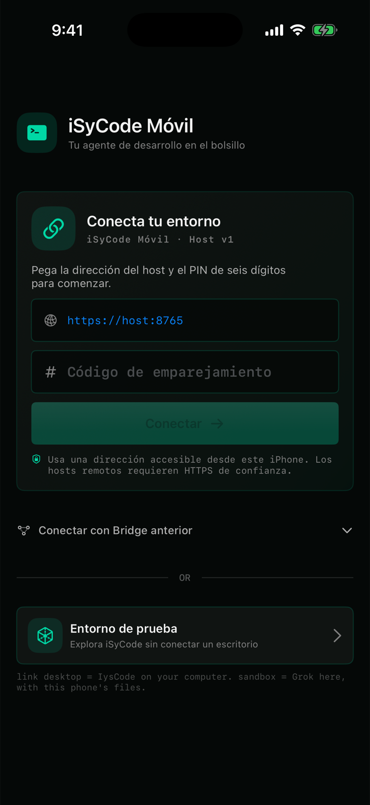
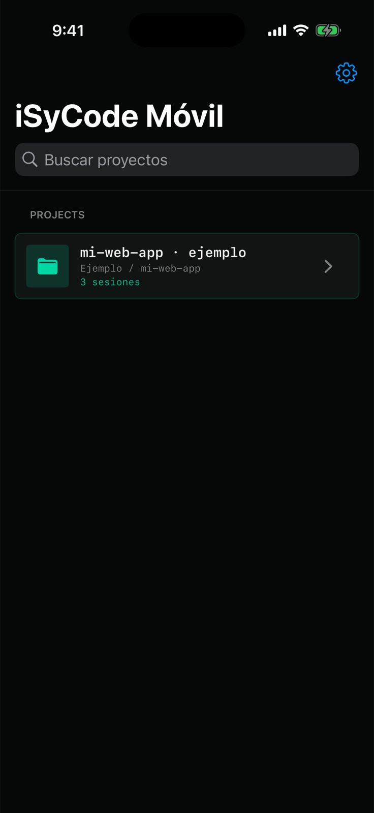
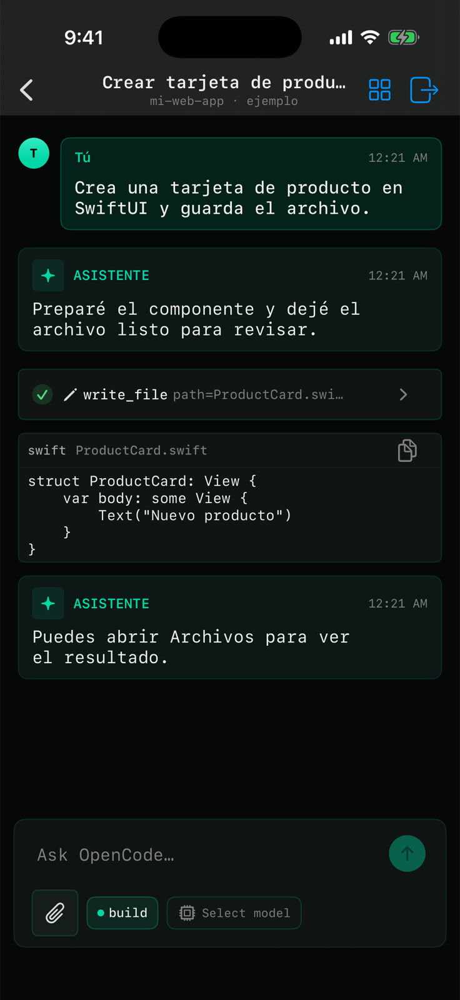

# iSyCode Móvil

### Tus proyectos y tus agentes, contigo en el iPhone.

**iSyCode Móvil forma parte de la familia iSyCode.** La TUI de iSyCode para computadora, que estamos preparando para publicar en estos días, será el centro de ejecución: iniciará el host, descubrirá los runtimes instalados y gestionará sesiones y permisos. Esta app es su compañero nativo para iPhone: conecta, muestra conversaciones y te permite responder desde donde estés.

Hoy también puedes usar el **sandbox del iPhone** para explorar la interfaz sin computadora, o conectarte mediante los puentes disponibles de OpenCode y Codex. El host integrado de la futura TUI ya tiene emparejamiento v1; las sesiones remotas mediante ese host siguen en desarrollo.

[](https://github.com/DannyBaanks/iSyCodeMovil/actions/workflows/ios-build.yml)
[Instalar en iPhone](#instalar-en-iphone) · [Ver la app](#la-app-por-dentro) · [Conectar una computadora](#conectar-una-computadora) · [La familia iSyCode](#la-familia-isycode)

---

## La app por dentro

Estas pantallas salen de la app compilada en el **iPhone Simulator de GitHub Actions**. Las vistas de proyectos, sesiones y chat usan datos de ejemplo creados solo para las capturas. No contienen conversaciones ni claves de un teléfono personal.

| Conectar | Proyectos |
| :---: | :---: |
|  |  |
| **Empareja tu entorno o abre el sandbox.** | **Encuentra tu espacio de trabajo.** |

| Sesiones | Conversación |
| :---: | :---: |
|  |  |
| **Retoma cada tarea donde quedó.** | **Distingue mensajes, acciones y resultados.** |

El workflow también publica las cuatro imágenes como artefacto **IysCodeMovil-ci-screenshots**.

---

## Instalar en iPhone

La app todavía se distribuye desde GitHub Actions mientras preparamos una forma de instalación más sencilla:

1. Abre [Actions → iOS Build](https://github.com/DannyBaanks/iSyCodeMovil/actions/workflows/ios-build.yml).
2. Entra a la última corrida verde de `main`.
3. En **Artifacts**, descarga **IysCodeMovil-unsigned** y extrae el archivo IPA.
4. Fírmalo e instálalo con tu Apple ID mediante [iloader](https://iloader.app/), [SideStore](https://sidestore.io/) o [AltStore](https://altstore.io/).

El CI entrega una **IPA sin firmar**. Con una cuenta Apple gratuita, la firma suele caducar a los siete días; vuelve a firmar la app cuando iOS lo pida.

## Elige cómo empezar

| Quiero… | Empiezo por… |
| --- | --- |
| Conocer la app sin computadora | **Entorno de prueba → ver el guion de demo**. Es una sesión offline y no requiere clave. |
| Trabajar con OpenCode en mi computadora | Ejecutar el Bridge y pegar el enlace que muestra. |
| Conversar con Codex desde el móvil | Usar la conexión experimental por Tailscale, con las funciones descritas en la [guía remota](docs/REMOTE.md#experimental-codex-app-server). |
| Emparejar con el host de iSyCode | Usar la dirección del host y el PIN de seis dígitos. Hoy permite conexión e inventario; la ejecución de sesiones llegará con la TUI. |

En el chat puedes seguir la conversación, distinguir las acciones del agente y responder a solicitudes de permiso. En el sandbox local, el agente empieza en el espacio privado de la app; tú decides si además le concedes una carpeta desde Archivos.

## La familia iSyCode

**iSyCode** es la experiencia de escritorio y el sustrato que estamos preparando para publicar en estos días. Su TUI arranca el host, detecta las herramientas instaladas en la computadora y aplica los permisos del usuario. **iSyCode Móvil** es la vista de bolsillo de ese ecosistema: empareja el iPhone, presenta sesiones y transmite tus decisiones al host.

El trabajo para unirlos avanza por etapas. El contrato **Host v1** ya contempla estado, PIN temporal, credencial guardada en el llavero e inventario de runtimes. La creación de sesiones, el streaming y las aprobaciones a través de ese host todavía están pendientes. Mientras tanto, el Bridge de OpenCode y la conexión experimental de Codex siguen disponibles.

---

## Conectar una computadora

### OpenCode, disponible hoy

Necesitas Node.js 18 o posterior, OpenCode instalado en la computadora y el iPhone en una red que pueda alcanzar esa computadora.

En una terminal, entra a la carpeta del proyecto que quieres abrir y ejecuta:

```bash
npx --yes github:DannyBaanks/IysCodeMovil#main link
```

El Bridge inicia `opencode serve`, genera una credencial temporal y muestra un enlace de emparejamiento. Copia el enlace completo, abre **Conectar con Bridge anterior** en la app y pégalo allí. Mantén el proceso abierto mientras uses la sesión.

### Codex, experimental

Codex App Server permite chat y aprobaciones desde el iPhone dentro de un perfil experimental. La [guía de conexión remota](docs/REMOTE.md#experimental-codex-app-server) explica el emparejamiento, el transporte por Tailscale y sus límites actuales.

### ¿Estás fuera de casa?

Usa una VPN privada como Tailscale entre el iPhone y la computadora. El Bridge OpenCode incluido usa HTTP con autenticación Basic; úsalo solo en una red de confianza o dentro de una VPN cifrada. **No expongas el puerto 4096 directamente a Internet.**

Detalles y transporte: [guía de conexión remota](docs/REMOTE.md).

---

## Sandbox del iPhone

El sandbox ejecuta un agente Swift nativo en el contenedor privado de iOS. Puedes:

- Probar el flujo demo sin conectarte a Internet ni configurar un modelo.
- Conectar una API compatible para usar un modelo remoto.
- Conceder una carpeta desde Archivos con el selector oficial de iOS; el permiso puede revocarse en Settings.
- Ver y aprobar operaciones que cambian archivos antes de ejecutarlas.
- Adjuntar archivos seleccionados mediante la interfaz de iOS.

Las claves API configuradas por la app se guardan en el Keychain. Si eliges un modelo en la nube, el contenido que envíes y los archivos que el agente lea pueden salir del teléfono hacia ese proveedor.

### Modelos del sandbox

El catálogo incluye NVIDIA NIM, xAI, OpenAI API, Google Gemini y OpenRouter. Los modelos disponibles dependen de la cuenta y de lo que anuncie el endpoint `/models` de cada proveedor. La suscripción de ChatGPT **no** incluye crédito de OpenAI API.

Para empezar, abre **Proveedores** en el selector del sandbox, elige un proveedor y agrega su clave. La app la conserva en el Keychain de ese iPhone.

---

## Qué puedes hacer hoy

| Experiencia | Estado | Incluye |
| --- | --- | --- |
| **Sandbox en el iPhone** | Disponible | Demo sin conexión, agente Swift, modelos con clave API, archivos privados o carpeta elegida en Archivos y aprobación de cambios. |
| **OpenCode en tu computadora** | Disponible mediante Bridge | Conversaciones, historial, streaming, acciones y permisos del runtime de escritorio. |
| **Codex en tu computadora** | Experimental | Chat, streaming e interrupción dentro del perfil de [Codex App Server](docs/REMOTE.md#experimental-codex-app-server). |
| **Host de la TUI iSyCode** | En desarrollo | El emparejamiento y el inventario v1 ya existen; sesiones y streaming por este host llegarán con la integración de escritorio. |

La compatibilidad con más runtimes, las acciones nativas del iPhone y la integración MCP avanzan por hitos. Puedes seguir el [roadmap de herramientas](docs/ROADMAP_CLIS.md) y la [propuesta de MCP](docs/CHATGPT_MCP.md).

### ¿Puede el agente usar todo mi iPhone?

El sandbox empieza en los archivos privados de iSyCode Móvil. Solo ve una carpeta externa si la eliges en Archivos. Las demás funciones del teléfono dependen de los permisos y superficies oficiales de iOS; la app no puede leer datos privados de otras apps ni controlar libremente sus pantallas. [Ver límites de iOS](docs/IOS_LIMITATIONS.md).

---

## Si algo no funciona

| Lo que ves | Qué revisar |
| --- | --- |
| `Could not connect to the server` | En el iPhone no uses `127.0.0.1` para llegar a tu computadora: usa la IP de LAN o Tailscale que muestra el Bridge. Confirma que siga ejecutándose. |
| El enlace no abre la app | Copia el enlace completo `iyscodemovil://...`; si hace falta, pégalo en la pantalla de conexión. |
| `Rate limited` | El proveedor rechazó temporalmente llamadas por cuota o frecuencia. Espera el tiempo indicado, revisa la cuota de esa API y evita reenviar el mismo mensaje varias veces. |
| La app no instala | Revisa que el IPA esté firmado y que confiaste en tu Apple ID en Ajustes → General → VPN y administración de dispositivos. |
| El sandbox no ve mi carpeta | Selecciónala desde Archivos dentro de la app. Si iOS revocó un permiso anterior, el sandbox abre su espacio privado y te pide volver a elegir la carpeta en Ajustes. |
| Codex muestra `initialize` o desconecta | Asegúrate de usar una versión de Codex compatible con el perfil del Bridge. Detalles y límites: [guía experimental de Codex](docs/REMOTE.md#experimental-codex-app-server). |

---

<details>
<summary>Para desarrolladores: compilar desde el código</summary>

<br>

Necesitas macOS, Xcode y [XcodeGen](https://github.com/yonaskolb/XcodeGen):

```bash
brew install xcodegen
xcodegen generate
open IysCodeMovil.xcodeproj
```

En Xcode, elige un iPhone Simulator o un dispositivo conectado y presiona **Run**. También puedes compilar desde terminal:

```bash
xcodebuild -scheme IysCodeMovil \
  -destination 'generic/platform=iOS Simulator' \
  build
```

Cada push a `main` compila la app, corre las pruebas en iOS Simulator y genera capturas de las pantallas para este README.

</details>

## Documentación y comunidad

- [Roadmap de runtimes CLI](docs/ROADMAP_CLIS.md)
- [Uso detallado](docs/USAGE.md)
- [Conexión y transporte](docs/REMOTE.md)
- [Reporte de compatibilidad](docs/OPENCODE_COMPAT.md)

El proyecto está bajo licencia MIT; consulta [LICENSE](LICENSE). iSyCode Móvil no está afiliado con OpenCode, Codex, Anthropic, Google, xAI, NVIDIA, OpenRouter ni OpenAI.
